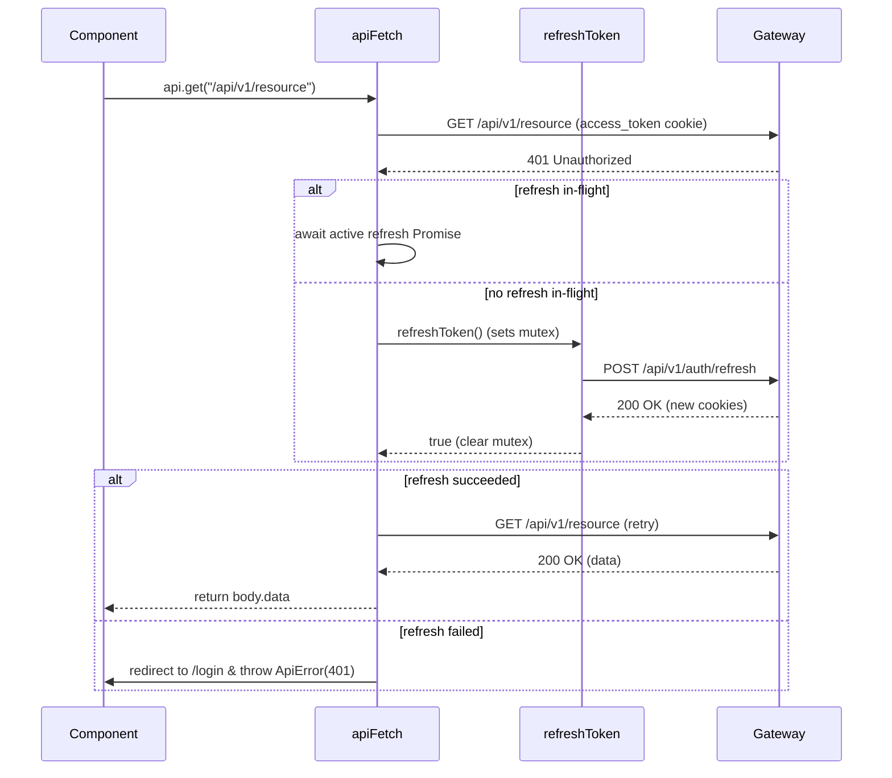

# Frontend — API Client

HTTP client contract, 401 refresh sequence, domain API modules, and typed BFF clients.

## `apiFetch` Contract (`lib/api/client.ts`)

- **Base URL:** Configured via `NEXT_PUBLIC_GATEWAY_URL` (`API_CONFIG.BASE_URL`).
- **Credentials:** `credentials: 'include'` on every request (transmits cookies).
- **CSRF Protection:** Reads `XSRF-TOKEN` cookie and attaches `X-XSRF-TOKEN` header on non-GET/HEAD requests.
- **Envelope Unwrapping:** Expects `{ status, title, code, message, data }` from `commons-core`. Returns `body.data` directly on success; throws `ApiError` on failure.

## 401 Refresh & Retry Sequence

The `refreshing` variable is a module-level `Promise<boolean> | null` mutex ensuring exactly one refresh call occurs concurrently across parallel requests.

## Typed BFF Clients (`lib/api/bff/`)

| Client Module | Function | Target Route |
|---|---|---|
| `overview.ts` | `getOverview` | `/api/v1/bff/overview` |
| `banks.ts` | `getBanks` | `/api/v1/bff/banks` |
| `transactions.ts` | `getTransactions` | `/api/v1/bff/transactions` |
| `categories.ts` | `getCategories` | `/api/v1/bff/categories` |
| `investments.ts` | `getInvestments` | `/api/v1/bff/investments` |
| `imports.ts` | `getImports` | `/api/v1/bff/imports` |
| `settings.ts` | `getSettings` | `/api/v1/bff/settings` |
| `search.ts` | `getSearch` | `/api/v1/bff/search` |

All BFF responses return typed `Section<T>` envelopes allowing resilient partial section rendering.

### BFF Type Generation & Drift Gate

BFF types in `lib/api/bff/schema.d.ts` are generated mechanically from `ms-gateway`'s OpenAPI spec (`openapi/gateway.json`). `lib/api/bff/types.ts` exports named aliases over this schema.

- **When `ms-gateway` BFF response records change:**
  1. Start the stack/gateway: `docker compose --profile app up -d gateway`
  2. Dump the OpenAPI snapshot: `./scripts/dump-gateway-openapi.sh` (from parent repo)
  3. Regenerate TypeScript definitions: `npm run bff:types`
  4. Commit both `openapi/gateway.json` and `lib/api/bff/schema.d.ts`.
- **Constraint:** Never hand-edit `schema.d.ts` or section response shapes in `types.ts`.
- **CI Gate:** `npm run bff:check` runs in CI to verify `openapi/gateway.json` matches `schema.d.ts`.

## Legacy Domain API Modules (`lib/api/`)

| Module | Endpoints Covered |
|---|---|
| `auth.ts` | Login, register, logout, refreshToken |
| `banks.ts` | Banks list, accounts CRUD, balance adjustments |
| `transactions.ts` | Transaction history, summary, record/update/delete |
| `categories.ts` | Category & subcategory CRUD, archive/restore |
| `loans.ts` | Loans list, originate, pay installment |
| `investments.ts` | Holdings, portfolio summary/evolution, prices |
| `notifications.ts` | Notifications list, unread count, mark read, preferences |
| `import.ts` | Statement upload preview, confirm, history, undo |
| `cards.ts` | Cards list, issue, billing cycle, pay installment |

## Auth Helpers (`lib/auth.ts`)

- `getUserFromCookie()`: Parses `user_info` cookie (`id|email|name`).
- `getCsrfToken()`: Reads `XSRF-TOKEN` cookie value.
- `isAuthenticated()`: Boolean check delegating to `getUserFromCookie()`.
