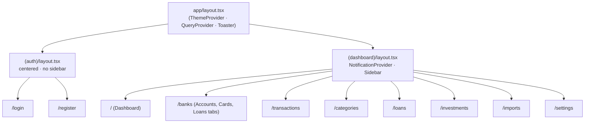

# Frontend — Routes and Components

Route structure, layout hierarchy, middleware rules, and component areas.

## Route Groups and Layouts

## Route Map

| Path | Layout | Purpose |
|---|---|---|
| `/login` | `(auth)` | User login form |
| `/register` | `(auth)` | User registration form |
| `/` | `(dashboard)` | Overview dashboard (served via `/api/v1/bff/overview`) |
| `/banks` | `(dashboard)` | Accounts, cards, and loans management tabs |
| `/transactions` | `(dashboard)` | Transaction history list, filters, and detail panel (served via `/api/v1/bff/transactions`) |
| `/categories` | `(dashboard)` | Category and subcategory management tree |
| `/loans` | `(dashboard)` | Loan origination and installment payment history |
| `/investments` | `(dashboard)` | Investment holdings, portfolio P&L, market discovery |
| `/imports` | `(dashboard)` | Bank statement PDF and generic CSV import wizard |
| `/settings` | `(dashboard)` | User preferences, profile, security, and manual FX rates |
| `/design-preview` | root | Gallery showcase of design system components and charts |

## Middleware (`middleware.ts`)

- Runs on all non-static paths (`matcher: ['/((?!_next/static|_next/image|favicon.ico|api).*)']`).
- Reads non-HttpOnly `user_info` cookie (written by backend on login). No gateway network calls are made.
- Redirects:
  - Missing `user_info` cookie + protected route → Redirects to `/login`.
  - Present `user_info` cookie + auth route (`/login`, `/register`) → Redirects to `/`.

## Component Areas

| Directory | Purpose |
|---|---|
| `components/charts/` | SVG charts: `AreaChart`, `BarPairChart`, `HorizonBars`, `CompositionBar`, `LegendList`, `Sparkline`, `primitives/` |
| `components/ui-kit/` | Wave 3 Design System UI kit: `money/`, `feedback/`, `shell/`, `overlay/`, `notifications/`, `layout/`, `controls/`, `table/`, `row/`, `data/`, `page/` (`banks/`, `investments/`, `imports/`) |
| `components/pages/` | Domain-scoped page content components |
| `components/shared/` | Legacy shared primitives |
| `components/ui/` | Headless shadcn/ui primitives (`button`, `dialog`, `select`, `tabs`, `input`, `form`, `badge`, `card`, `sonner`, etc.) |
